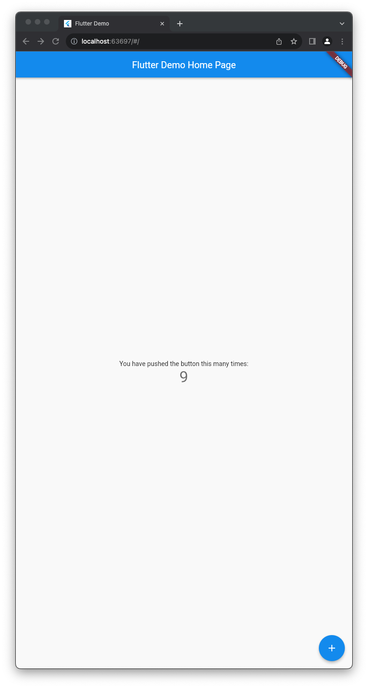

# my_own_cubit

This project describe how to build a Cubit without using [flutter_bloc](https://pub.dev/packages/flutter_bloc) package

# Clone the project

```
git clone https://github.com/kietdt/flutter_build_your_own_cubit.git
```

# set up project
```
flutter pub get
```

# run project

```
flutter run -d chrome --web-renderer html --web-port 5000
```

# Screenshot

| Home                                                 | 
| ---                                                  |
|          |